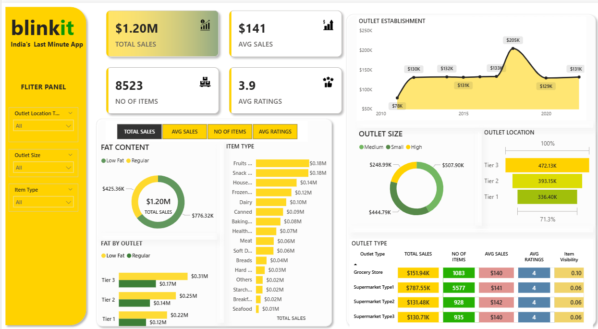
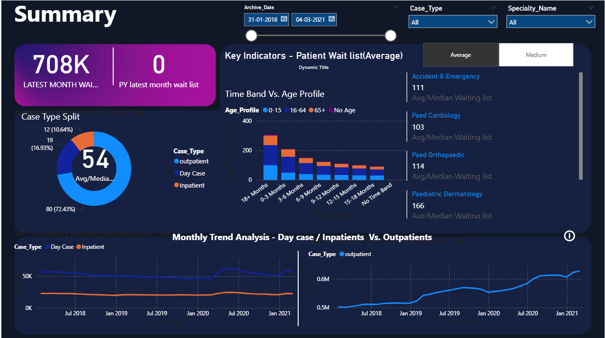

# Vennela M - Data Analyst

**Email:** vennela.m2003@gmail.com  
**Phone:** +91 96527 43406  
**GitHub:** [github.com/MaliambakamVennela](https://github.com/MaliambakamVennela)  
**LinkedIn:** [linkedin.com/in/m-vennela-0106md](https://www.linkedin.com/in/m-vennela-0106md)

---

## About Me
I am a Data Analyst with experience in Power BI, Excel, SQL, and VBA. I focus on transforming raw data into meaningful insights to support data-driven decision-making. Currently working at NIQ, Chennai, where I specialize in data visualization, reporting automation, and process optimization.

---

## Technical Skills

**Data and BI Tools:** Power BI, Excel (Advanced), VBA and Macros, SQL  
**Programming:** Java, HTML, CSS  
**Concepts:** ETL Process, Data Cleaning, Data Visualization, Reporting Automation  
**Other Tools:** Power Query, Power Automate, MS Office Suite

---

## Work Experience

### Data Analyst - NIQ, Chennai (Mar 2024 - Present)
- Managed large datasets from global clients including Nestle Purina, Coca-Cola, Mondelez, and General Mills.  
- Built interactive Power BI dashboards to enhance reporting and visibility.  
- Automated Excel-based reports using VBA, reducing manual effort by 30 percent.  
- Improved ETL workflows to ensure seamless data integration and accuracy.  
- Received Global Monthly Award and Thumbs-Up Token Award for innovation and teamwork.  
- Mentored new analysts and collaborated with teams to deliver data-driven insights.

---

## Education

- MCA - Sri Venkateswara University (2023-2025) - CGPA: 8.0 (Expected)  
- B.Sc (M.S.Cs) - Sri Venkateswara University (2020-2023) - CGPA: 8.5  
- Intermediate (MPC) - AP State Board (2018-2020) - CGPA: 7.2  
- SSC - Z.P. High School, Kotha Aruru (2018) - CGPA: 8.8

---

## Projects

### 1. Blinkit Sales Analysis Dashboard (Power BI, SQL, Excel)
- Designed a Power BI dashboard to analyze Blinkit sales performance.  
- Used SQL for data extraction and transformation.  
- Created KPI cards, DAX measures, and visuals to track performance trends.  
- Delivered insights on seasonal sales and top-performing categories.
  

### 2. Netflix Data Analysis (SQL)
- Used SQL to analyze movie and TV show popularity across regions and years.  
- Applied joins, CTEs, and window functions to extract insights on trends and engagement.

### 3. Healthcare Insights Dashboard (Power BI)
- Developed a Power BI dashboard to analyze hospital operations and patient data.  
- Used DAX and time-intelligence functions for growth and cost analysis.
 

---

## Awards and Certifications

- Certified Java Full Stack Developer - J Spiders Hebbal  
- Global Monthly Award - NIQ  
- Thumbs-Up Token Award - NIQ  
- Volleyball Zonal Level Player

---

## Contact
Open to collaborations, analytical roles, and data-driven projects.  
**Email:** vennela.m2003@gmail.com
